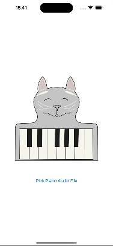

# Piano Transcriber

Piano Transcriber is an iOS app that given an audio file with piano music will generate midi events corresponding to what is being played.
The app looks like this:

  
  
  

Piano Transcriber is fully open source, and all processing is happening on the device itself, and nothing is being sent to a remote server.

The model powering Piano Transcriber can be found at [audio-to-midi](https://github.com/kasper0406/audio-to-midi).

In order to build Piano Transcriber, it needs a framework produced by the audio-to-midi project, to get the actual midi events form the model output. Currently this is palces in this repository in the `model_utils` folder as a static build. If you want to modify this logic, the code is found at the [Rust plugins for audio-to-midi](https://github.com/kasper0406/audio-to-midi/tree/main/rust-plugins).

## Piano samples acknowledgements
For this app, I used the [Yamaha-Grand-Lite-SF-v1.1](https://drive.google.com/file/d/1L-y9m4UyTKRa8kbiC7Vx4dESe2wcEXat/view?usp=sharing) Piano samples from [Soundfonts 4U](https://sites.google.com/site/soundfonts4u/).
